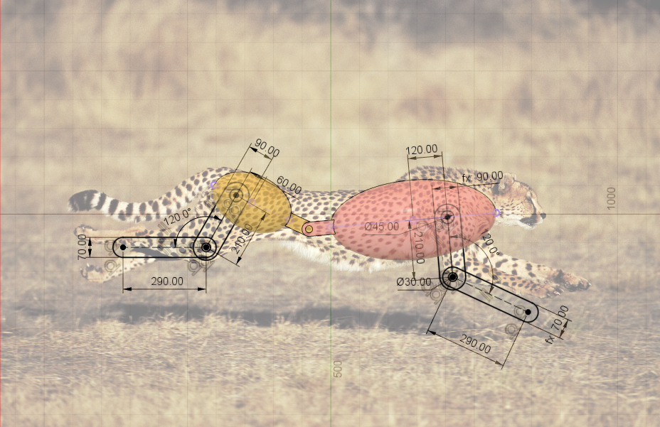

# Cheetah Robot Models

This repository contains CAD models, URDF, and XML models for Mujoco of a cheetah robot. These models are designed for robotic simulation and can be further developed or adapted as needed.

## Repository Structure

```
/cad         - SolidWorks CAD models of the cheetah robot  
/cheetah     - Robot models for simulation:
   - cheetah.urdf: URDF model for ROS/Gazebo simulation
   - cheetah.xml: XML model for Mujoco simulation
/images      - Reference images showing the structure and dimensions
```

## Images and Dimensions

The `/images` folder contains reference images illustrating the cheetah robot's structure and key dimensions:

**Basic View:** 

  

**Torso Dimensions:** 

 

**Legs Dimensions:** 

   

These dimensions are provided to assist in future development and modification of the robot.

## License

Apache 2.0